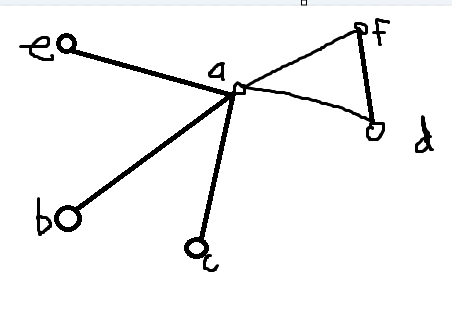

# UG 14 GRAPH
### **Kerjakan di file main.py**

Kalian diberikan sebuah file python dengan class Graph. method - method pada class ini hampir sama selurhnya dengan yang ada di modul, hanya ada beberapa perubahana. Method edge di modul berubah menjadi get_edge. Method get_edges akan me-return list dari semua edge yang ada. method find_path pada modul berubah menjadi find_path_dfs. Fungsi ini juga memiliki logika yang sedikit berbeda dari modul karena yang ada di modul salah.

Tugas kalian sekarang adalah untuk membuat 2 buah method, yaitu remove_vertex dan remove_edge.

- remove_edge(self, edge)
  
  method ini akan menerima sebuah parameter berupa nama edge. Seperti namanya, method ini akan menghapus edge pada graf sesuai dengan namanya. Lakukanlah error handling untuk menangani apabila edge yang dimasukkan sebagai parameter fungsi tidak ada, atau error karena hal - hal yang lain.

- remove_vertex(self, vertex)
  
  method ini akan menerima sebuah parameter berupa nama vertex. Method ini akan menghapus vertex yang ada pada graf sesuai dengan namanya.
  Lakukan error handling seperti method sebelumnya.

## Test Case

Test case ini akan membentuk graf seperti ini:

    g : Graph = Graph()
    for i in ["a", "b", "c", "d", "e", "f", "g", "h"]:
        g.add_vertex(i)
    
    g.add_edge("a", "b")
    g.add_edge("a", "c")
    g.add_edge("a", "d")
    g.add_edge("a", "e")
    g.add_edge("a", "f")
    g.add_edge("d", "f")
    print("edges sebelum dihapus: ")
    print(g.get_edges()) 
    g.remove_edge("af")
    print()
    print("Edges setelah hapus edge af: ")
    print(g.get_edges())
    g.remove_vertex("a")
    print()
    print("Edges setelah hapus vertex a")
    print(g.get_edges())

## Output
    edges sebelum dihapus: 
    ['af', 'ab', 'df', 'ae', 'ac', 'ad']

    Edges setelah hapus edge af:
    ['df', 'ab', 'ae', 'ac', 'ad']

    Edges setelah hapus vertex a
    ['df']

